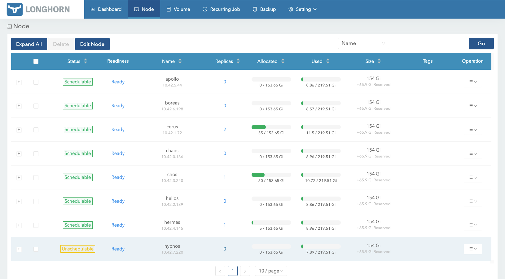
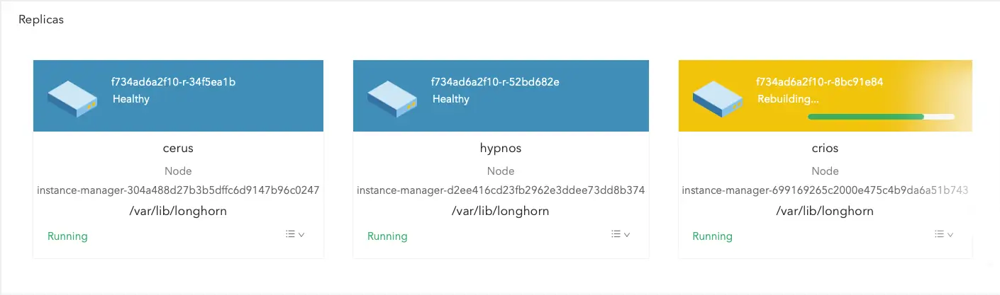

This repository uses [Longhorn](https://longhorn.io), delivering simplified, cloud-native persistent block storage without the cost overhead of open core or proprietary alternatives.

<!--more-->

## Backup

Longhorn uses various backup target endpoints, used to access a `backupstore`. A backup target endpoint with `cifs` protocol is configured by default, used with an existing TrueNAS Scale `nfs` share and related [`credentials.j2`](https:///blob/main/roles/longhorn/templates/credentials.j2) secret:

```yaml
longhorn_vars:
  kubernetes:
    backup:
      enabled: true
      target: cifs://nas.noty.cc/backup
```

Refer to the official [documentation](https://longhorn.io/docs/latest/snapshots-and-backups/backup-and-restore/set-backup-target), to configure the backup target endpoint with a different protocol. Depending on chosen protocol, the [`credentials.j2`](https:///blob/main/roles/longhorn/templates/credentials.j2) secret will require an update.

## Node Drain

The node drain behavior is controlled with `longhorn_vars.kubernetes.default_settings.node_drain_policy` and `longhorn_vars.kubernetes.default_settings.pod_deletion_policy` variables, defined into [`main.yaml`](https:///blob/main/roles/longhorn/defaults/main.yaml) defaults file.

Example of a manual node drain:

```shell
$ kubectl drain hypnos --delete-emptydir-data --ignore-daemonsets
node/hypnos cordoned
Warning: ignoring DaemonSet-managed Pods: kube-system/cilium-envoy-dksxd, kube-system/cilium-rhhlf, kube-system/engine-image-ei-51cc7b9c-zbx65, kube-system/kured-gxkjq, kube-system/longhorn-csi-plugin-xv5xz, kube-system/longhorn-manager-zr7qs, kube-system/vls-vector-wsmbq, kube-system/vmks-prometheus-node-exporter-7z4zx
evicting pod kube-system/argo-cd-argocd-application-controller-7c768c5fb8-vspvg
evicting pod kube-system/argo-cd-argocd-repo-server-54bd46d95b-zrr45
evicting pod kube-system/instance-manager-d2ee416cd23fb2962e3ddee73dd8b374
evicting pod kube-system/vmks-victoria-metrics-operator-79588f8bb7-bzp4c
evicting pod kube-system/vmsingle-vmks-victoria-metrics-k8s-stack-7dc6b865fb-n8lhb
pod/argo-cd-argocd-application-controller-7c768c5fb8-vspvg evicted
pod/argo-cd-argocd-repo-server-54bd46d95b-zrr45 evicted
pod/vmsingle-vmks-victoria-metrics-k8s-stack-7dc6b865fb-n8lhb evicted
pod/vmks-victoria-metrics-operator-79588f8bb7-bzp4c evicted
evicting pod kube-system/instance-manager-d2ee416cd23fb2962e3ddee73dd8b374
error when evicting pods/"instance-manager-d2ee416cd23fb2962e3ddee73dd8b374" -n "kube-system" (will retry after 5s): Cannot evict pod as it would violate the pod's disruption budget.
evicting pod kube-system/instance-manager-d2ee416cd23fb2962e3ddee73dd8b374
error when evicting pods/"instance-manager-d2ee416cd23fb2962e3ddee73dd8b374" -n "kube-system" (will retry after 5s): Cannot evict pod as it would violate the pod's disruption budget.
evicting pod kube-system/instance-manager-d2ee416cd23fb2962e3ddee73dd8b374
pod/instance-manager-d2ee416cd23fb2962e3ddee73dd8b374 evicted
node/hypnos drained
```

During the node drain process, monitor the node into Longhorn UI:

[](longhorn-node-drain.webp)

And the related volume replicas rebuild status:

[](longhorn-replicas-rebuild.webp)
